# ARCHITECTURE.md — Fonctionnement du programme Philosophers

Modèle : **1 thread par philosophe** + **1 thread monitor** + le thread `main`.
Ressources partagées protégées par mutex. Fin de simulation via un flag `stop`.

---

## 1. Vue d'ensemble des fichiers et fonctions

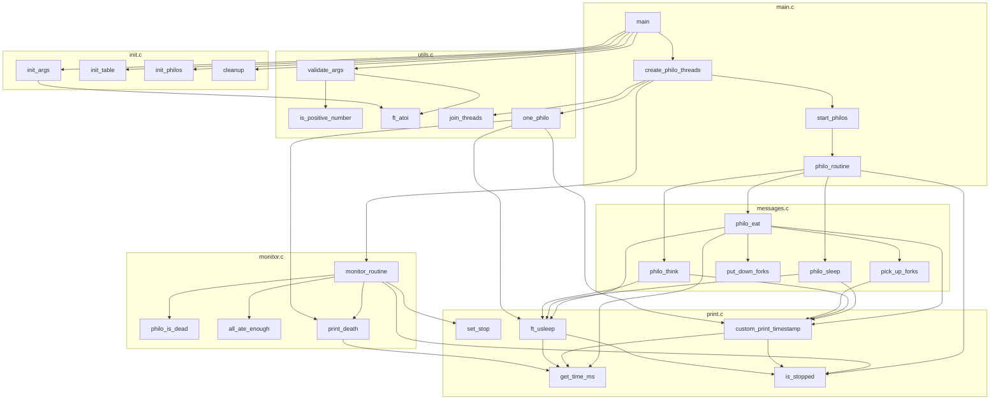

---

## 2. Structures de données

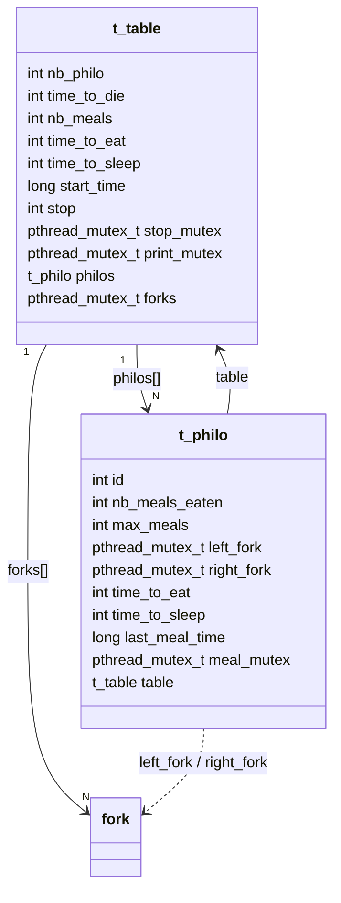

Champs protégés par mutex : `stop` (stop_mutex), `nb_meals_eaten` +
`last_meal_time` (meal_mutex), `stdout` (print_mutex). `nb_meals = -1` signifie
« pas de limite de repas ».

Partage des fourchettes en anneau : `philo[i].left = forks[i]`,
`philo[i].right = forks[(i+1) % nb_philo]`.

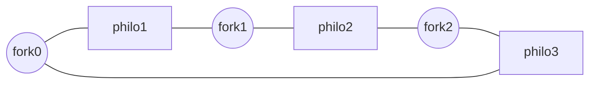

---

## 3. Cycle de vie global (main)

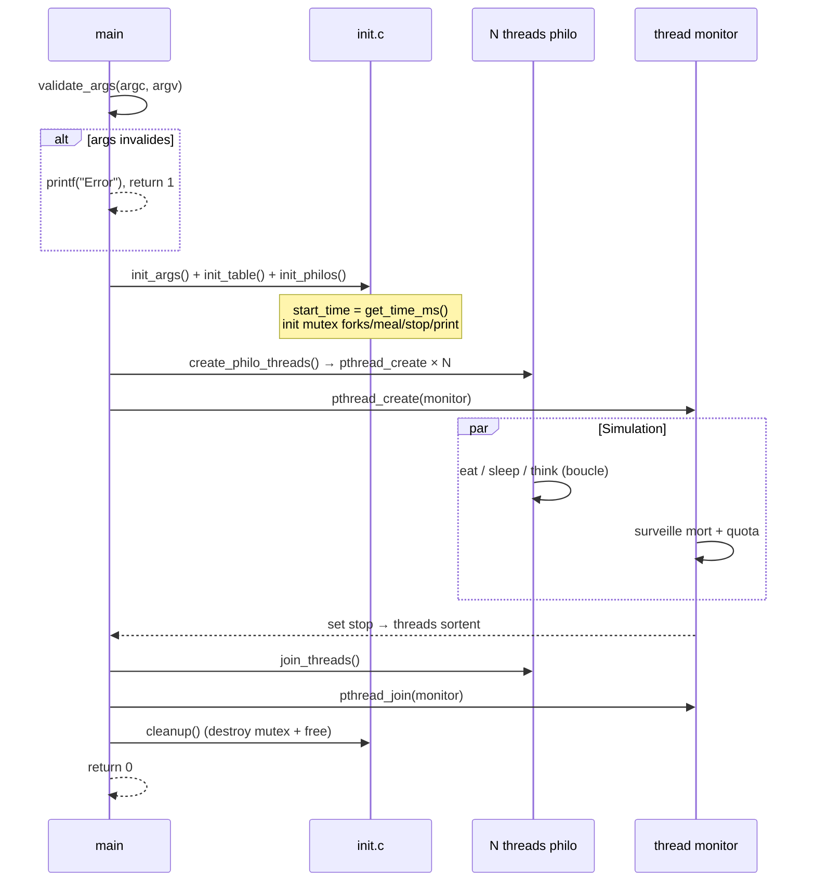

---

## 4. Routine d'un philosophe — `philo_routine`

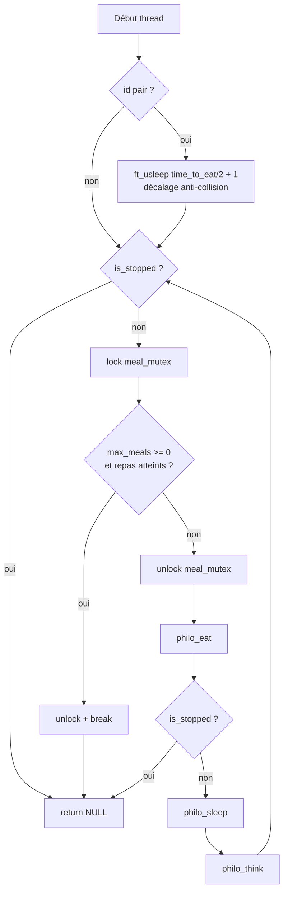

---

## 5. Manger — `philo_eat` (section critique)

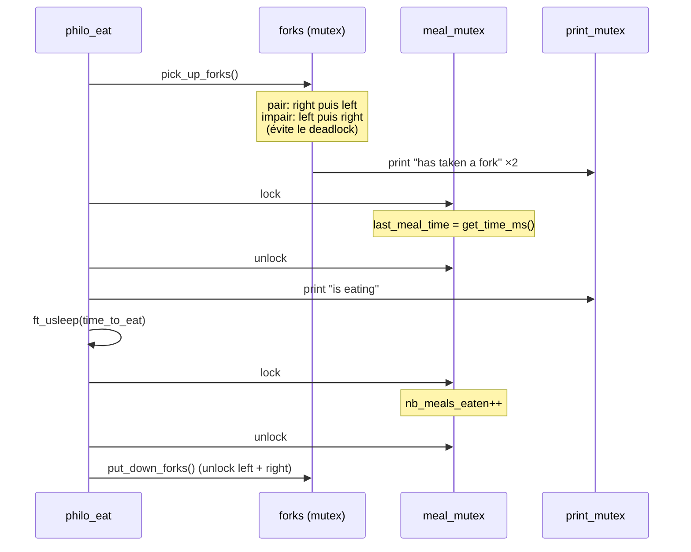

Ordre de prise des fourchettes (anti-deadlock) :

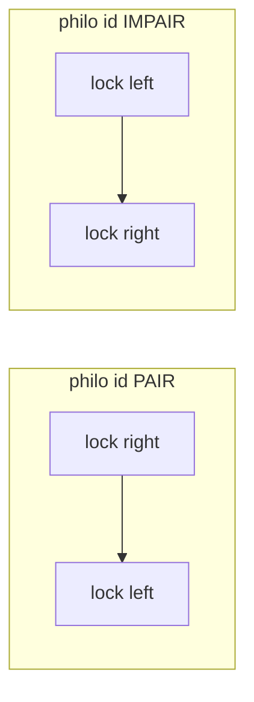

---

## 6. Surveillant — `monitor_routine`

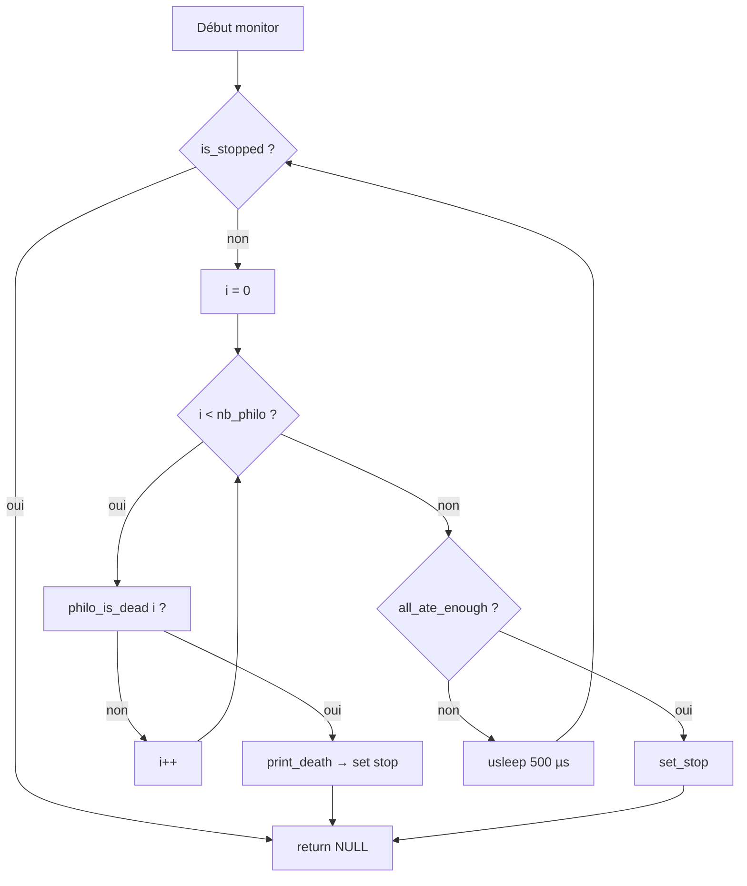

`philo_is_dead(i)` :

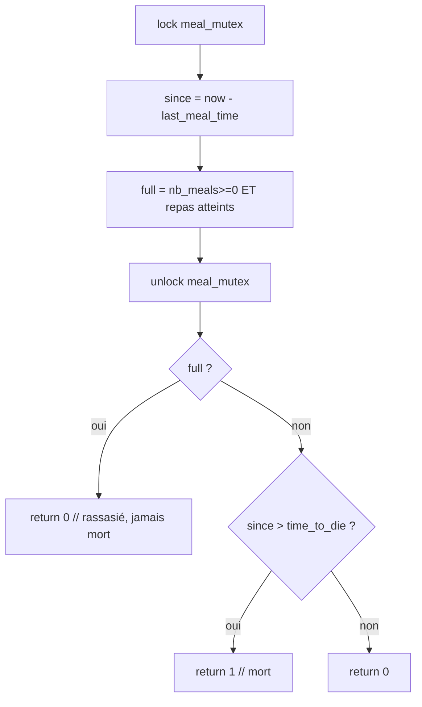

---

## 7. Affichage sûr et arrêt sans course

Règle clé : `print_mutex` protège **à la fois** l'affichage **et** la pose du flag
`stop`, pour garantir qu'**aucune ligne n'est écrite après `died`**.

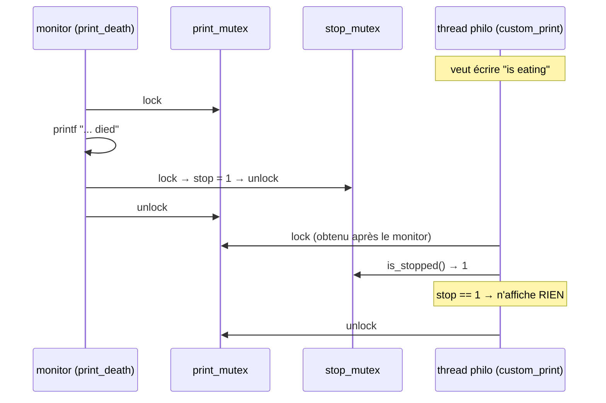

`custom_print_timestamp` :

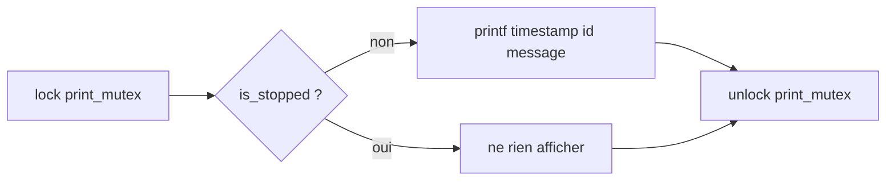

---

## 8. Temporisation précise — `ft_usleep`

`usleep` seul est imprécis et n'écoute pas l'arrêt. `ft_usleep` découpe l'attente
en petits pas de 200 µs et sort dès que `stop` est levé.

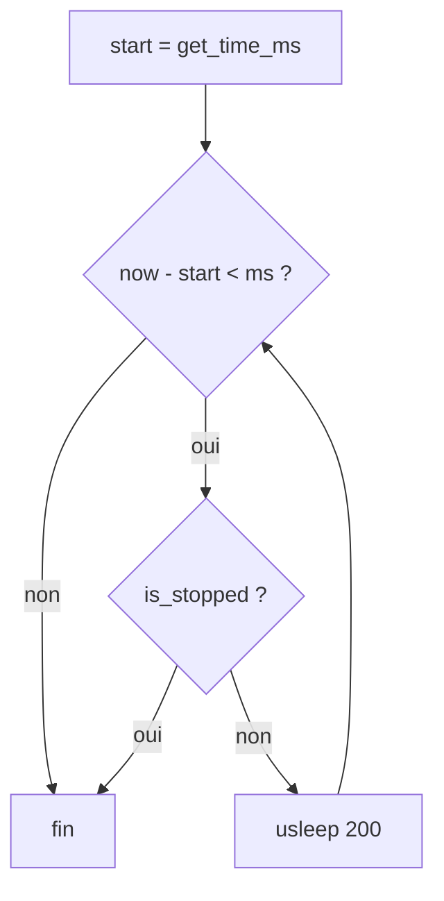

---

## 9. Carte des mutex (qui protège quoi)

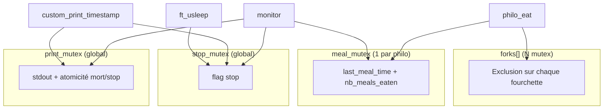

Ordre de verrouillage (jamais inversé → pas de deadlock entre mutex globaux) :
`print_mutex` **puis** `stop_mutex`. `meal_mutex` et `forks` se prennent seuls.

---

## 10. Référence fonction par fonction

### main.c
| Fonction | Rôle |
|----------|------|
| `main` | Valide les args, initialise, lance threads, join, nettoie. |
| `start_philos` | Crée les N threads philosophes ; en cas d'échec : `set_stop` + join partiel. |
| `create_philo_threads` | Cas `nb_philo == 1` → `one_philo` ; sinon crée philos + monitor, join tout. |
| `philo_routine` | Boucle de vie d'un philo : décalage pair, check quota, eat/sleep/think, sortie sur `stop`. |

### init.c
| Fonction | Rôle |
|----------|------|
| `init_args` | Parse argv → `t_table` (nb_meals = -1 si absent). |
| `init_table` | `start_time`, mutex `stop`/`print`, alloc + init `forks[]`. Renvoie 1 si `malloc` échoue. |
| `init_philos` | Alloc + init chaque `t_philo` (fourchettes, meal_mutex, table). Renvoie 1 si `malloc` échoue. |
| `cleanup` | Destroy tous les mutex (tolérant `philos == NULL`) + `free`. |

### utils.c
| Fonction | Rôle |
|----------|------|
| `one_philo` | Cas 1 philo : lock 1 fourchette, attend `time_to_die`, meurt. |
| `is_positive_number` | Valide une chaîne : `+` optionnel, chiffres, `<= INT_MAX`. |
| `validate_args` | Vérifie toutes les chaînes + bornes (`nb_philo/die/eat/sleep >= 1`). |
| `join_threads` | `pthread_join` sur les threads. |
| `ft_atoi` | Conversion str → int (avec bornes). |

### messages.c
| Fonction | Rôle |
|----------|------|
| `pick_up_forks` | Prend les 2 fourchettes selon parité (anti-deadlock), affiche « has taken a fork ». |
| `put_down_forks` | Relâche les 2 fourchettes. |
| `philo_eat` | Prend fourchettes, met à jour `last_meal_time`, mange (`ft_usleep`), incrémente repas, relâche. |
| `philo_sleep` | Affiche « is sleeping » puis `ft_usleep(time_to_sleep)`. |
| `philo_think` | Affiche « is thinking » puis attend `(die-eat-sleep)/2` (anti-famine). |

### print.c
| Fonction | Rôle |
|----------|------|
| `get_time_ms` | Temps courant en ms (`gettimeofday`). |
| `is_stopped` | Lit `stop` sous `stop_mutex`. |
| `set_stop` | Met `stop = 1` sous `stop_mutex`. |
| `ft_usleep` | Attente précise interruptible par `stop`. |
| `custom_print_timestamp` | Affiche `timestamp id message` sous `print_mutex`, rien si `stop`. |

### monitor.c
| Fonction | Rôle |
|----------|------|
| `print_death` | Affiche `died` + pose `stop`, atomiquement sous `print_mutex`. |
| `philo_is_dead` | Vrai si `now - last_meal > time_to_die` et philo non rassasié. |
| `all_ate_enough` | Vrai si `nb_meals` défini et tous ont atteint leur quota. |
| `monitor_routine` | Boucle : détecte mort (→ `print_death`) ou fin quota (→ `set_stop`). |

---

## 11. Conditions d'arrêt

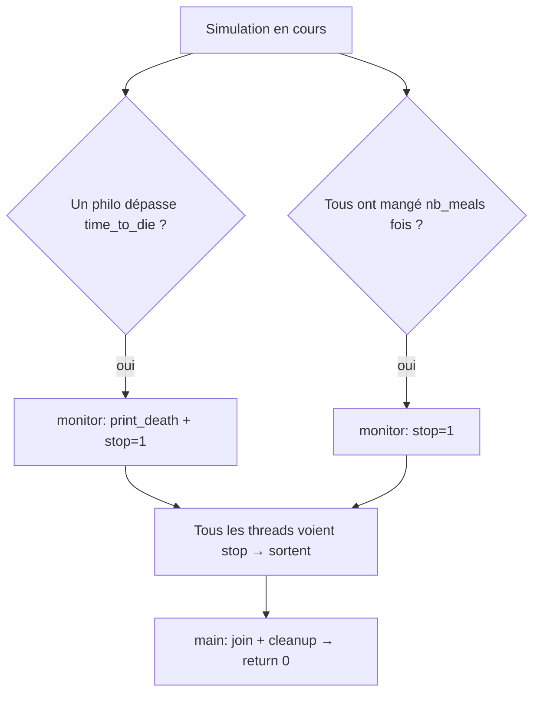
